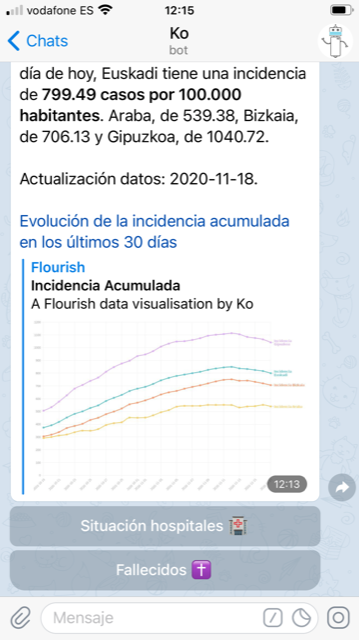

# Kaixo! Me llamo Ko!

**Ko** es un bot de Telegram que ofrece a los usuarios información básica sobre la evolución de la pandemia de la Covid-19 en Euskadi. El proyecto nace con el objetivo de facilitar a cualquier persona acceso rápido y sencillo a los indicadores básicos que miden la evolución de la pandemia (casos, incidencia, situación hospitales y decesos) para que en todo momento cualquier ciudadano interesado tenga una fotografía real de la situación. El bot además ofrece información sobre las restricciones vigentes, cómo prevenir contagios y qué hacer en caso de tener síntomas.

El proyecto ha sido presentado a la tercera edición del concurso Open Data del Gobierno vasco.

### Cómo funciona

Para entablar una conversión con Ko, sólo tienes que buscarlo en Telegram (@Ko19Bot) o abrir este enlace: https://t.me/Ko19Bot.

A través de un sencillo menú, podrás obtener información sobre los indicadores básicos de la evolución de la pandemia, además de información relativa a las restricciones vigentes, cómo prevenir contagios y qué hacer si tienes síntomas.

  

    
  

  

    
  

  

    
  

### Por dentro

He programado el bot en Python a través de la librería Python Telegram Bot y he adaptado para el diseño de la conversación [uno de los ejemplos de la documentación oficial de la propia librería, incluyendo más opciones de interacción para el usuario](https://github.com/python-telegram-bot/python-telegram-bot/blob/master/examples/inlinekeyboard2.py).

He extraído los datos que ofrece Ko al usuario del [conjunto de Open Data Euskadi sobre la evolución del coronavirus](https://opendata.euskadi.eus/catalogo/-/evolucion-del-coronavirus-covid-19-en-euskadi/). En concreto, para obtener las cifras relativas a la incidencia y casos, he usado los documentos 02.csv y 04.csv de la carpeta de Situación Epidemiológica, y el 08.csv, para la evolución de fallecidos. En el caso de los datos relativos a los ingresos en planta en los hospitales y en las Unidades de Cuidados Intensivos, he usado los documentos 08.csv y 09.csv de la carpeta de Datos Asistenciales. También he utilizado Python para la extracción y limpieza de los datos.

Solo los gráficos que incluyo en los mensajes que el bot envía al usuario están hechos en una aplicación externa, Flourish.

Por último, he utilizado Heroku para alojar el bot en la nube y que sea accesible las 24 horas del dia.

